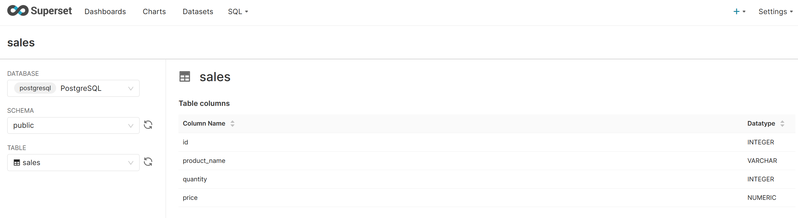
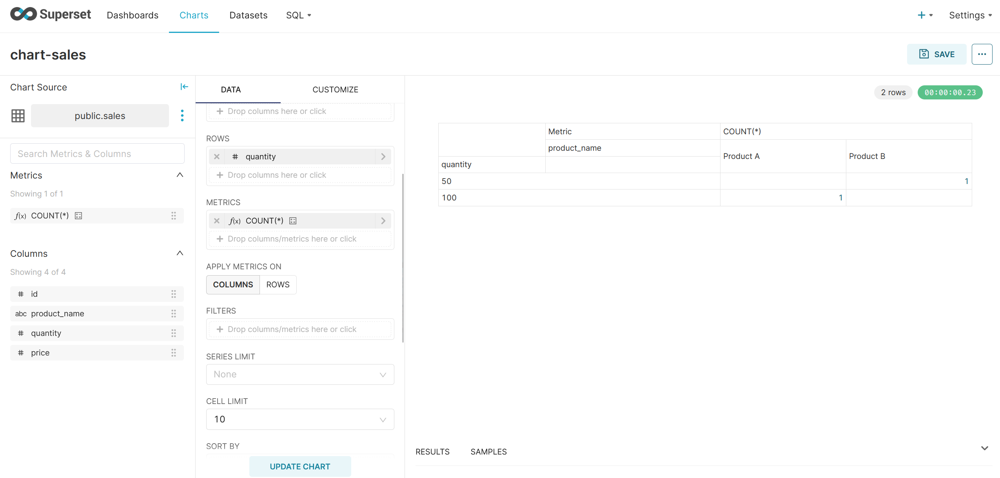
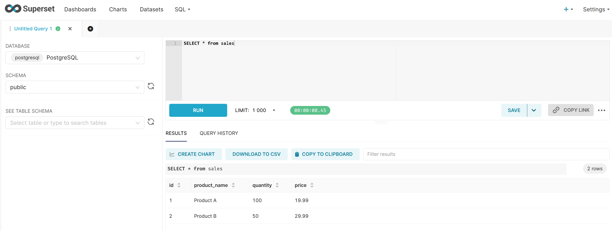

# はじめに
Netsugenセミナー

[システム構成図]
ココにシステム構成図を記載

# 目的
docekrの理解
ネットワーク
ボリュームなど

# バージョンの管理
OSSを使う際は、常にリリースノートや最新情報をキャッチしておくことが重要となる。

今回はApache SupersetとPostgreSQLの活用に伴い、関連ドキュメントを貼る。

## Officialサイト

## GitHubリポジトリ

[Apache Superset GitHub](https://github.com/apache/superset)

[PostgreSQL Github](https://github.com/postgres/postgres)


## 設計思想の起源
PostgreSQLの論文

# docker build create

```

[コンテナ停止コマンド]
docker-compose -f superset-dev.yaml down

[イメージビルドコマンド]
docker-compose -f superset-dev.yaml build

[コンテナランコマンド]
docker-compose -f superset-dev.yaml up -d
```

# ソースコード読解編
Apache Supersetは、Pythonベースで記載されている。
レベルアップに伴い、OSSのコード読解・コントリビュートも視野に入れていきたいので、軽くソースを読んでみる。

# 初期パスワード作成

Apache SupsersetコンテナはUIでの接続確認ができても、ユーザが登録されていない。そのため、コンテナ側からユーザを作成する。
```
[実行コマンド]
docker exec -it superset superset fab create-admin

[結果]
/usr/local/lib/python3.10/site-packages/flask_limiter/extension.py:
...
Username [admin]: 
User first name [admin]: 
User last name [user]: 
Email [admin@fab.org]: 
Password: 
Repeat for confirmation: 
Recognized Database Authentications.
Admin User admin created.
```

# CLIでDBの接続確認
Apache Supersetコンテナにて、きちんとPostgreSQLコンテナにへ接続が通るか簡単にテストする。

```
[実行コマンド]
bash -c "exec 3<>/dev/tcp/superset_db/5432; echo OK"

[結果]
OK
```

試しにポートを変えてみた。

```
[実行コマンド]
bash -c "exec 3<>/dev/tcp/superset_db/5431; echo OK"

[結果]
bash: connect: Connection refused
bash: line 1: /dev/tcp/superset_db/5431: Connection refused
OK
```
ポートをわざと異なるものに設定した場合、接続が通らなくなった。ここからも、ポート指定が正しく行われていたことが分かった。

# PostgereSQLへデータ追加

PostgreSQLにログイン
```
$ psql -U username -d dbname
```
 DB一覧表示
```
$ \l
```
データベースに接続
```
$ \c データベース名
```
$ テーブル一覧表示
```
$ \dt
```
SELECT文実行
```
$ SELECT * FROM table_name;
```

テーブル作成(そのままコピーして流してOK)
```
CREATE TABLE sales (
    id SERIAL PRIMARY KEY,
    product_name VARCHAR(100),
    quantity INT,
    price DECIMAL
);
```

確認
```
[実行コマンド]
superset=# SELECT * FROM sales;

[結果]
id | product_name | quantity | price 
----+--------------+----------+-------
(0 rows)
```
現在、該当のテーブルは空なので、データを挿入する。

```
[実行コマンド]
INSERT INTO sales (product_name, quantity, price) 
VALUES ('Product A', 100, 19.99),
       ('Product B', 50, 29.99);

```

先ほどと同様のselect文にて以下のように結果を確認する。


```
[実行コマンド]
SELECT * FROM sales;

[結果]
 id | product_name | quantity | price 
----+--------------+----------+-------
  1 | Product A    |      100 | 19.99
  2 | Product B    |       50 | 29.99
(2 rows)

```

# UI側で確認



チャートを作成する。



SQL Labからクエリを投げてみる。



ダッシュボードの作成
検証中
