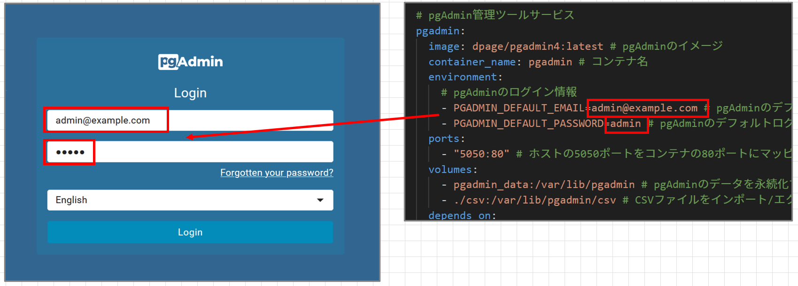
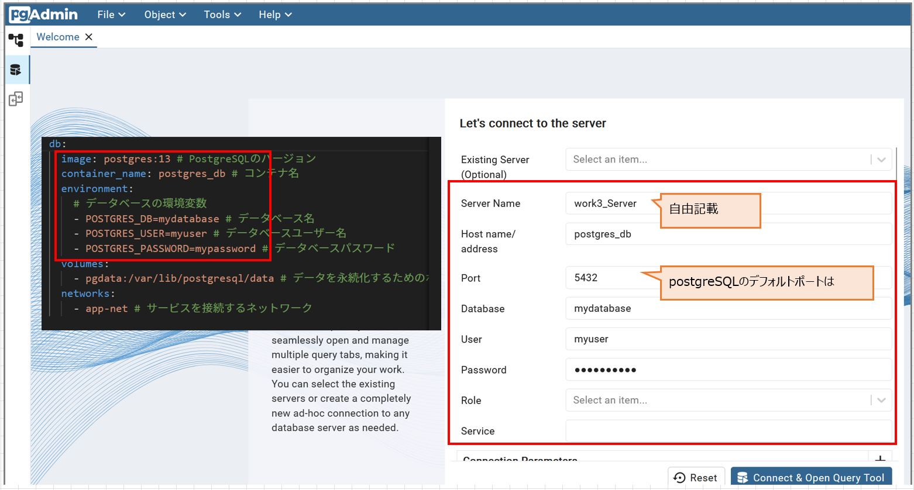

# DB用のコンテナを起動する
work2では、コンテナにNginxをインストールすることでWebサーバ用として活用した。

ここでは、コンテナにPostgreSQLをインストールすることで、DBとして活用する。

[docker-compose.yamlの内容確認](./docker-compose.yaml)

DB用コンテナを起動する。
```
[実行コマンド]
docker compose -f docker-compose.yaml up -d
```

# WebUI上でDBの内容を閲覧する
初回ログインについて解説。
```
[アクセスURL(最後に5050番ポートを指定)]
http://ec2-xxx-xxx-xxx-xxx.ap-northeast-1.compute.amazonaws.com:5050
```

User名・パスワードを用いてログイン



DB登録する



## テーブルの場所
```
Servers
└── PostgreSQL [バージョン番号]
    └── Databases
        └── mydatabase ← ここが選ばれてる
            └── Schemas
                └── public ← よく使うスキーマ
                    └── Tables ← ★作ったテーブルがここ！

```


# 応用問題

# PostgreSQLへデータ追加

PostgreSQLにログイン
```
$ psql -U username -d dbname
```
 DB一覧表示
```
$ \l
```
データベースに接続
```
$ \c データベース名
```
$ テーブル一覧表示
```
$ \dt
```
SELECT文実行
```
$ SELECT * FROM table_name;
```

テーブル作成(そのままコピーして流してOK)
```
CREATE TABLE sales (
    id SERIAL PRIMARY KEY,
    product_name VARCHAR(100),
    quantity INT,
    price DECIMAL
);
```

確認
```
[実行コマンド]
superset=# SELECT * FROM sales;

[結果]
id | product_name | quantity | price 
----+--------------+----------+-------
(0 rows)
```
現在、該当のテーブルは空なので、データを挿入する。

```
[実行コマンド]
INSERT INTO sales (product_name, quantity, price) 
VALUES ('Product A', 100, 19.99),
       ('Product B', 50, 29.99);

```

先ほどと同様のselect文にて以下のように結果を確認する。


```
[実行コマンド]
SELECT * FROM sales;

[結果]
 id | product_name | quantity | price 
----+--------------+----------+-------
  1 | Product A    |      100 | 19.99
  2 | Product B    |       50 | 29.99
(2 rows)

```

# UI側で確認


チャートを作成する。


SQL Labからクエリを投げてみる。


ダッシュボードの作成
検証中