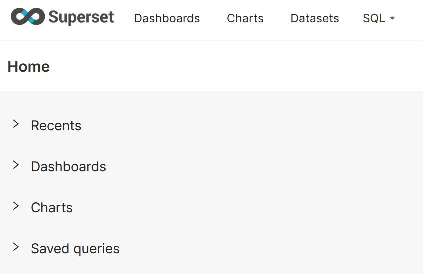

# DB解析用のBIツールコンテナを起動する

work3までで、webサーバ、DB用のコンテナを立ち上げることができた。
ここでは、新たにBIツール用のコンテナを立ち上げ、データ解析を行う。

# 起動済コンテナ周りををクリーンにする

DB情報などが引き継がれないように、コンテナ周りを確認しておく。

Docker Volume(ホストとコンテナでデータ連携するためのもの)確認
```
[確認コマンド]
docker volume list

[結果]
DRIVER    VOLUME NAME
local     posgtredb_pgadmin_data
local     posgtredb_pgdata
local     work3_postgresql_pgadmin_data
local     work3_postgresql_pgdata
```

Docker Network確認
```
[確認コマンド]
docker network list

[結果]
NETWORK ID     NAME                DRIVER    SCOPE
d2de2cc65433   bridge              bridge    local
c8df5d5985f0   host                host      local
144630201e2d   none                null      local
d966ab2a6077   posgtredb_app-net   bridge    local

```

ワークショップの過程でたくさん作成されているが、いったんこのままにする。

削除したい場合は、`docker volume rm [volume名]`と入力する。


# コンテナの起動

イメージビルドから行う。

```
[実行コマンド]
docker compose -f docker-compose.yaml up --build -d

[結果]
[+] Building 15.4s (3/5)                                                                                                                                                                        docker:default
 => [superset internal] load build definition from Dockerfile                                                                                                                                             0.1s
 => => transferring dockerfile: 107B                                                                                                                                                                      0.0s
 => [superset internal] load metadata for docker.io/apache/superset:latest                                                                                                                                1.9s
 => [superset internal] load .dockerignore                                                                                                                                                                0.0s
 => => transferring context: 2B                                                                                                                                                                           0.0s
 => [superset 1/2] FROM docker.io/apache/superset:latest@sha256:2fcf0baa9db5ad5a6b345afa46604b25740d4014430d7d09eaf8d5ae76aa451c                                                                         13.4s
 => => resolve docker.io/apache/superset:latest@sha256:2fcf0baa9db5ad5a6b345afa46604b25740d4014430d7d09eaf8d5ae76aa451c                                                                                   0.0s
 => => sha256:aa4c50520a70b21f24a2a395328e3918494d36680515b554a3c2a05ea55ba67e 3.53kB / 3.53kB                                                                                                            0.0s
 => => sha256:dad67da3f26bce15939543965e09c4059533b025f707aad72ed3d3f3a09c66f8 28.23MB / 28.23MB                                                                                                          1.0s
 => => sha256:4b03b4f4fa5c508f2b215b45a26f6dd30b310aaa2a4a24b593f630bdf07da1a8 3.51MB / 3.51MB                                                                                                            0.5s
 => => sha256:50a956a18493962b03f716b86299535ce63a1d6a1a1770be582b59f8fedb46b7 15.65MB / 15.65MB      
```

コンテナが立ち上がったらWebUIからアクセスする。


```
[アクセス用URL]
http://ec2-xxx-xxx-xxx-xxx.ap-northeast-1.compute.amazonaws.com:8088
```

サインイン画面が表示される。


Apache Supsersetの場合、手動で初期ユーザを作成する必要がある。


# 初期ユーザ・初期パスワードの作成

Apache SupsersetコンテナはUIでの接続確認ができても、ユーザが登録されていない。

そのため、コンテナ側からユーザを作成する。(今回はデフォルトでOK パスワードもadmin)
```
[実行コマンド]
docker exec -it superset superset fab create-admin

[結果]
/usr/local/lib/python3.10/site-packages/flask_limiter/extension.py:
...

[以下、入力画面(ブランク入力でデフォルト値が入る)]
Username [admin]: 
User first name [admin]: 
User last name [user]: 
Email [admin@fab.org]: 
Password: 
Repeat for confirmation: 
Recognized Database Authentications.
Admin User admin created.

```

ログインできた




# PostgreSQLの接続設定

pgAdminにログイン

```
[URL]
http://ec2-xxx-xxx-xxx-xxx.ap-northeast-1.compute.amazonaws.com:5050

ユーザ情報の入力(docker-compose.yamlのpgadmin部分参照)
ユーザ：admin@admin.com
パスワード：admin
```

左側の「Servers」を右クリックして、「Register」→「Server」を選択する。

以下の情報を入力

```
◆General タブ
Name: 任意の名前（例: Superset Database など）

◆Connection タブ
Host name/address: PostgreSQLのコンテナ名(superset_db)
Port: 5432（デフォルト）
Maintenance database: superset
Username: superset（PostgreSQLのユーザー名）
Password: superset（PostgreSQLのパスワード）入力後、接続を保存して完了。
```

# ファイルアップロードしてテーブルを作成する

# データ可視化

Kaggleから気象データを取得・アップロード

# 応用問題

## 自動化
Airflow


# DB登録
完了
アイコンから比較的簡単に設定可能。

# ファイルアップロードしてテーブル作成したい

気象データセット
[Kaggle Dataset](https://www.kaggle.com/datasets/muthuj7/weather-dataset)

